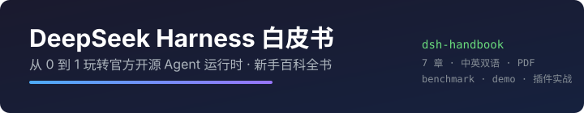
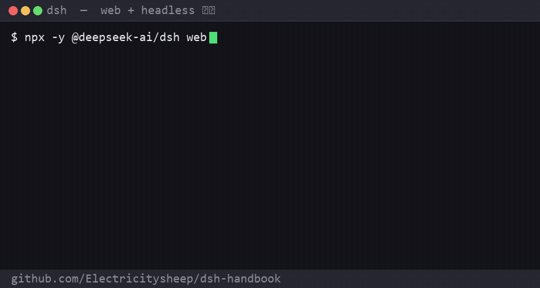
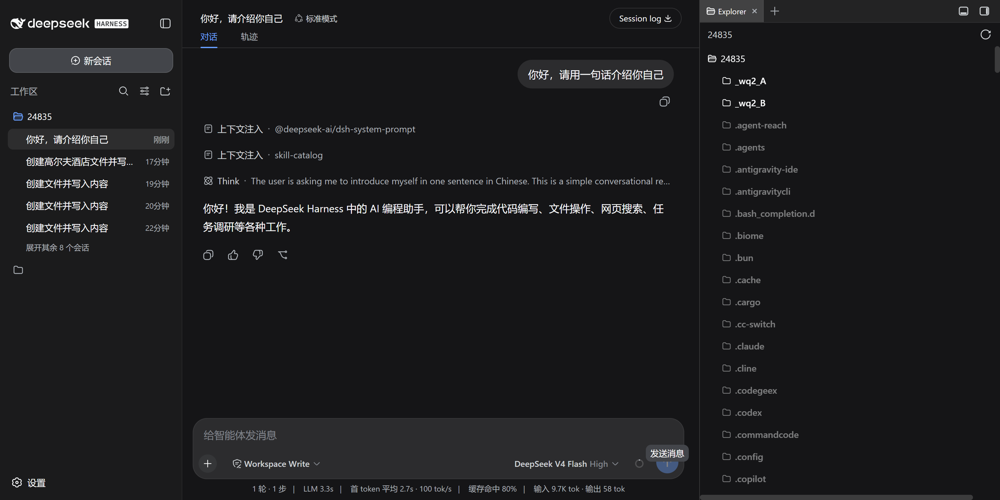
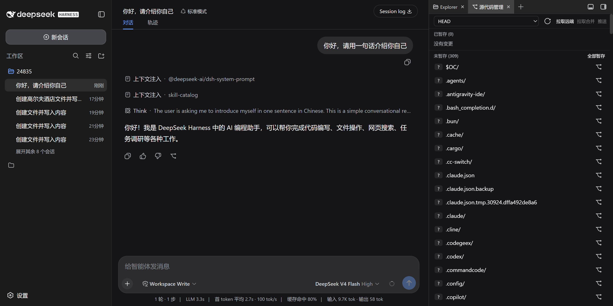

# DeepSeek Harness Handbook · dsh-handbook

> **From zero to one with DeepSeek Harness — the beginner's encyclopedia for DeepSeek's open-source agent runtime.**
> English · [中文](./README.md)

<p align="center">
  
</p>

<div align="center">


</div>

> [!WARNING]
> dsh is currently at `0.1.0-rc.6` (pre-release). API/config may change with breaking changes; evaluate carefully before production use.

## 🚀 30-second quickstart

```bash
# 1. Install (needs Node.js ≥ 22)
npx -y @deepseek-ai/dsh web

# 2. Open http://127.0.0.1:3080 and start chatting
# 3. Or run a one-shot task (scripts / CI)
dsh --profile headless "Hello, introduce yourself in one sentence"
```

<p align="center">
  
  <br/>
  <sub><b>30 seconds to "get it"</b>: install → Web UI → headless task → tool-chain loop (85s · 27/27)</sub>
</p>

> Want the full path? [🗺 3-day learning path](./docs/roadmap.md) · Jump straight in: [Chapter 2: 5-min quickstart](./docs/02-quickstart.en.md) · Cheat sheet: [📇 one-page card](./docs/cheatsheet.md)

## 🎯 What this is

**DeepSeek Harness (`dsh`)** is the agent runtime open-sourced by DeepSeek on 2026-08-13 — an "everything is a plugin" framework built on Cordis, with `web` + `headless` profiles and a plugin ecosystem.


But the official docs focus on architecture — **the beginner path is missing**. This handbook fills it: from "what is an agent runtime" to install, usage, plugin development and performance tuning. **Every chapter is copy-paste runnable and verified on real hardware. Any developer can go from zero to productive.**

### Why read this (instead of the official docs)

| Official docs | This handbook |
|---|---|
| Architecture view (AGENTS.md / architecture.md) | **Beginner view**: a zero-to-one path |
| Scattered examples | **Every chapter runnable**, commands verified |
| English only | **Bilingual**, Chinese-first + English chapters |
| No ecosystem practice | **Real plugin/PR breakdowns** (pitfalls & safety included) |

## 🎁 What you get

| If you are… | You get |
|---|---|
| 🆕 **New to dsh** | A 3-day zero-to-one path (daily goals + acceptance checks) |
| 🛠 **A developer** | Clone-and-run plugin template + full config reference |
| ⚖️ **Evaluating options** | 6-agent comparison (table + prose) + same-model benchmark |
| ⚡ **Tuning for speed** | Reasoning-effort strategy + cache-hit deep dive (measured ~97%) |
| 📚 **Looking for cases** | 5 real complex cases (with timing / artifacts / verification) |

## 📚 Table of contents (zero → one)

### 🟢 Stage 1 · Understand & Onboard

<div align="center">

| 📖 **[Ch. 1 · Understanding Harness](./docs/01-intro.en.md)** | ⚡ **[Ch. 2 · 5-Minute Quickstart](./docs/02-quickstart.en.md)** |
|---|---|
| What it is, vs Claude Code/Codex/OpenCode, capability matrix | Install, web/headless modes, reasoning effort, troubleshooting |

</div>

### 🔵 Stage 2 · Build: Skeleton & Plugins

<div align="center">

| 🧩 **[Ch. 3 · Profiles & Plugin System](./docs/03-profiles.en.md)** | 🛠️ **[Ch. 4 · Plugin Dev, Hands-On](./docs/04-plugin-dev.en.md)** |
|---|---|
| Customizable skeleton, mounting, host/client halves, extension points, real pitfalls | Write your first plugin (full code + tests + live verification) |

</div>

### 🟠 Stage 3 · Practice: Scenarios & Tuning

<div align="center">

| 📦 **[Ch. 5 · Real-World Cases](./docs/05-cases.en.md)** | 🚀 **[Ch. 6 · Advanced & Performance](./docs/06-advanced.en.md)** |
|---|---|
| 3 real open-source PRs, cache-hit-rate deep dive, industry views | reasoning_effort strategy, latency analysis, 7 pitfalls |

</div>

### 🟣 Stage 4 · Ecosystem: Capability & Orchestration

<div align="center">

| 🌐 **[Ch. 7 · Ecosystem & Resources](./docs/07-ecosystem.en.md)** | 🧰 **[Ch. 8 · Tools & Context System](./docs/08-tools-context.en.md)** | 🔗 **[Ch. 9 · MCP, Subagents & Workflows](./docs/09-mcp-subagent-workflow.en.md)** |
|---|---|---|
| Official entry points, how to join, reading paths | 60+ capability packages, built-in tools, compaction | External tools, parallel subagents, multi-step orchestration |

</div>

### 🔴 Stage 5 · Advanced: Complex Cases & Outlook

<div align="center">

| 🧪 **[Ch. 10 · Complex Real Cases](./docs/10-complex-cases.en.md)** | 🔮 **[Ch. 11 · Future Outlook](./docs/11-future.md)** | ⚠️ **[Ch. 12 · Known Limitations](./docs/12-limitations.md)** |
|---|---|---|
| Run live in dsh: data pipeline 186s, 5-bug fix 94s | Tech / ecosystem / competition / risk predictions | rc instability, Windows bugs, early ecosystem — honest edition |

</div>

### 📎 Appendix

<div align="center">

| 📚 **[Glossary & Command Reference](./docs/appendix-glossary.md)** · **[Benchmark](./docs/benchmark.md)** |
|---|
| 30+ terms · command cheatsheet · same-model 3-agent benchmark |

</div>

## 💎 Key highlights (open to read, not just links)

<details>
<summary><b>📖 Ch. 1 — three intuitions + capability matrix</b></summary>

- dsh = the LEGO base for agents; harness = the engineering layer around the model; 2026 = the programmable-agent era
- MIT · TypeScript · "everything is a plugin" · released 2026-08-13
- dsh vs 5 agents (Claude Code / Codex / OpenCode / Gemini / Kimi): open-source ✅, model-agnostic ✅, **official-grade plugin system** (unique), custom UI ✅, headless CI ✅
</details>

<details>
<summary><b>⚡ Ch. 2 — 30 seconds to running</b></summary>

- One command: `npx -y @deepseek-ai/dsh web` → http://127.0.0.1:3080
- Dual modes: web (chat UI) / headless (`dsh --profile headless "task"`, CI-friendly)
- Reasoning effort: `low` (fast/simple) · `high` (default) · `max` (hard reasoning) — **thinking is ~90% of tool-chain latency**
</details>

<details>
<summary><b>🧩 Ch. 3 — profiles & the plugin system</b></summary>

- profile = bundle stack + your patch layer (`package.json` + `cordis.patch.yml`)
- Mounting a plugin = 2 edits (add dependency + add insert line)
- host/client halves: one npm package = Node-side tools/services + browser-side UI
- 5 extension points + 6 real pitfalls (rc.1 dependency breakage, missing `main`, un-awaited `next()`…)
</details>

<details>
<summary><b>🛠 Ch. 4 — plugin development, full working code</b></summary>

- From-scratch speed-up plugin (`dsh-tool-turbo`): pure-function decision + `agent/request` waterfall injection
- Key trick: extract decision logic into pure functions (millisecond unit tests) → verify only "did injection happen" on real hardware
- Live log evidence: `calls=[{name:"write"}] => reasoningEffort=low`
</details>

<details>
<summary><b>📦 Ch. 5 — three real open-source PRs, end to end</b></summary>

- Git panel push/pull/fetch (PR #10): `--force-with-lease` safety line + local bare-repo integration tests + Playwright verification
- HTML draft preview (PR #11): srcdoc decision pure function under sandbox constraints
- tool-turbo speed plugin: step-by-step reasoning downgrade
</details>

<details>
<summary><b>🚀 Ch. 6 — where the time goes</b></summary>

- Performance model: ~90% of tool-chain time is model thinking (before every tool call)
- Strategy: `low` for simple rounds / `high` daily / `max` complex — **downgrading is the highest-leverage speedup**
- 7 real pitfalls, incl. the evaluation trap "task suddenly faster = cache hit"
</details>

<details>
<summary><b>🌐 Ch. 7 — the map to the dsh ecosystem</b></summary>

- Official entry: repo / API docs / Discord / Discussions
- Current status: official repo isn't accepting external PRs → **plugins are the named contribution path**
- Beginner path: use it → small PR → ship a plugin → write content
</details>

<details>
<summary><b>🧰 Ch. 8 — tools & context system</b></summary>

- 60+ official capability-package map: tools/context/session/subagents/MCP/workflows/security
- Built-in tools (verified): read/write/grep/glob/edit/bash/todo/skill
- Artifact tracking: tool returns locations → open at end of conversation
- Context injection (layered system prompt + skill catalog), auto-compaction, sandbox/permission/approval security layer
</details>

<details>
<summary><b>🔗 Ch. 9 — MCP, subagents & workflows</b></summary>

- MCP: connect external tool servers (community token-tracking plugin exists)
- Subagents: parallel delegation (large-repo research / long-task decomposition)
- Workflows: deterministic multi-step orchestration (fetch → clean → report → verify)
- 4-stage path: single agent → +MCP → +subagents → +workflows
</details>

<details>
<summary><b>🧪 Ch. 10 — complex cases actually run by dsh</b></summary>

- Case A: data-quality analysis → cleaning → visualization (186s, chart.png, trade-offs documented)
- Case B: 5-bug fix + 49 tests (94s, pytest 49 passed, edge cases covered)
- Profile: auto-orchestrated tool chains, real judgment, traceable artifacts
- Privacy: all synthetic data / self-written code
</details>

<details>
<summary><b>📚 Appendix — glossary + commands</b></summary>

- 30+ terms: harness/profile/bundle/cordis/extension point/waterfall/compaction…
- Command cheatsheet: dsh core / env / troubleshooting / plugin dev
- Benchmark: same-model 3-agent (3-round median)
</details>

## 🖥 Demo

### ① Web UI chat (`dsh web`)

```bash
dsh web    # → http://127.0.0.1:3080
```



### ② Headless CLI (one-shot task, scripts/CI)

```bash
dsh --profile headless "Hello, introduce yourself in one sentence"
# → Hello! I'm a DeepSeek-powered AI coding assistant...
```

### ③ Plugin ecosystem (Git panel, `dsh-better-sidebar`)



## 🧰 Quick assets (essentials right here)

<details>
<summary><b>📇 One-page cheatsheet</b> — install · commands · reasoning effort · troubleshooting</summary>

```bash
npx -y @deepseek-ai/dsh web          # install & launch Web UI
dsh --profile headless "task"        # one-shot task (scripts/CI)
```
Reasoning effort: `low` (fastest/simple) · `high` (default) · `max` (hardest)
> Full card: [docs/cheatsheet.md](./docs/cheatsheet.md)
</details>

<details>
<summary><b>🔧 Plugin template</b> — mount in 2 steps</summary>

```yaml
# ① package.json dependency
"my-plugin": "link:C:\\path\\to\\my-plugin"
# ② cordis.patch.yml mount
- insert:
    - id: my-plugin
      name: my-plugin
```
> Clone-and-run template (pure functions + waterfall + tests): [examples/plugin-template/](./examples/plugin-template/README.md)
</details>

<details>
<summary><b>⚙️ Config reference</b> — settings.yaml core</summary>

```yaml
agent-default-model:
  model: deepseek-v4-flash    # or deepseek-v4-pro
  reasoningEffort: high       # low / high / max
```
> Full reference (profile/cordis.patch.yml/scenarios): [docs/config-reference.md](./docs/config-reference.md)
</details>

<details>
<summary><b>❓ FAQ Top 5</b></summary>

1. **Is dsh a model?** No — a runtime; models plug in via the llm plugin
2. **vs Claude Code?** Claude Code is the "whole car"; dsh is the "LEGO base" (open, customizable)
3. **Does it cost money?** dsh is free/open-source; conversations billed per use (98% cache discount, ~97% hit rate measured)
4. **Plugin 404?** rc.1 dependency breakage — pin the `^0.1.0-rc.6` line
5. **Production-ready?** rc stage has breaking changes; ecosystem play is fine now
> Full FAQ: [docs/faq.md](./docs/faq.md)
</details>

## ⚖️ dsh vs mainstream agents (capability matrix)

| Dimension | **dsh** | Claude Code | OpenAI Codex | OpenCode | Gemini CLI | Kimi CLI |
|---|---|---|---|---|---|---|
| Open source | ✅ MIT | ❌ | ❌ | ✅ MIT | ❌ | ❌ |
| Model binding | model-agnostic | Claude family | GPT family | any | Gemini family | Kimi family |
| **Plugin system** | **official-grade: everything is a plugin, 60+ packages** | config/hooks | config | config | none | none |
| Custom UI | ✅ (client half) | ❌ | ❌ | partial | ❌ | ❌ |
| Automation/CI | ✅ headless | ✅ | ✅ | ✅ | ✅ | ✅ |
| TUI | plugin-able | ✅ built-in | ✅ built-in | ✅ built-in | ✅ | ✅ |
| Ecosystem stage | day zero (2026-08-13) | mature | mature | mature | mature | early |
| Best for | deep customization + ecosystem | out of the box | out of the box | OpenCode users | Google | Kimi |

## 📊 Same model × different agents (measured 2026-08-13)

> Same model `deepseek-v4-flash` (same gateway, same key) — only the agent engineering layer differs. All 3 tasks completed correctly; the difference is efficiency:

| Agent | Total time | Correct |
|---|---|---|
| **omp** | **36s** | 27/27 ✅ |
| **dsh** | **85s** | 27/27 ✅ |
| **opencode** | 114s | 27/27 ✅ |

> 3-round median, 27/27 all correct. Full methodology: [📊 Benchmark appendix](./docs/benchmark.md)

## 📄 PDF

- **Chinese full edition**: [DeepSeek-Harness-白皮书.pdf](./DeepSeek-Harness-白皮书.pdf) (12 chapters, ~120k chars, 5.5MB, professional typesetting: cover/TOC/styles)
- **English full edition**: [DeepSeek-Harness-Handbook.pdf](./DeepSeek-Harness-Handbook.pdf)

## 🌐 Ecosystem links

Methodology comes from real open-source work:
- [dsh-tool-turbo](https://github.com/Electricitysheep/dsh-tool-turbo) — tool-call latency optimizer (source for ch. 4/6)
- [DSH-better-sidebar](https://github.com/omdsh-dev/DSH-better-sidebar) — community sidebar plugin (ch. 5 cases)
- Active on the official repo discussions: deepseek-ai/deepseek-harness (#380 plugin pitfalls, #401 Windows path bugs, #392 TUI examples, #384 visionDS, #118)

## 🙏 Contribute

- ⭐ Found it useful? Star it — it drives continued updates
- Commands broken? rc releases iterate fast — open an issue
- Want to help? See [CONTRIBUTING.md](./CONTRIBUTING.md) · [ROADMAP.md](./ROADMAP.md) · [Ch. 7: Ecosystem](./docs/07-ecosystem.en.md)

## ℹ️ Version

- Based on dsh `0.1.0-rc.6` / DeepSeek-V4-Flash-0731 (open-sourced 2026-08-13)
- Verified on Windows 11 + Node 24

## 📜 License

Content [CC BY-NC-SA 4.0](https://creativecommons.org/licenses/by-nc-sa/4.0/) · Example code MIT
