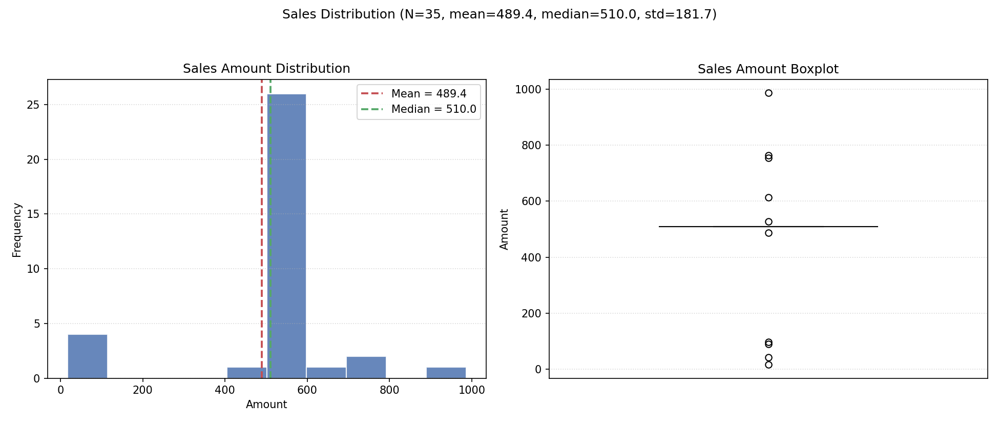

[English](./10-complex-cases.en.md) | [中文](./10-complex-cases.md) · [← Back](../README.md)

# Chapter 10: Complex Real-World Cases (Run Live in dsh)

> **Goal of this chapter:** Demonstrate dsh's actual capabilities, output quality, and timing on multi-step tool chains through two **complex tasks completed live in dsh.**
> **Privacy notice:** Both cases use **synthetic data / self-authored code** only. No real business data or sensitive information is involved.

## Case A: Data Quality Analysis + Cleaning + Visualization (186 seconds)

### Task

Give dsh a synthetic JSON file with dirty data (52 rows: missing values, type errors, duplicate rows, outlier value 99999), and ask it to:
1. Analyze data quality issues
2. Write a cleaning script `clean.py`
3. Write a visualization script `visualize.py` (generating `chart.png`)
4. Run both scripts to verify

### How dsh Did It (Tool Chain)

```
read(sales_data.json) → write(clean.py) → bash(python clean.py)
→ write(visualize.py) → bash(python visualize.py) → read(output) → summary
```

### Output & Verification

| Artifact | Result |
|---|---|
| `clean.py` | ✅ Runs successfully, 52 → **35 rows**, all issues resolved |
| `visualize.py` + `chart.png` | ✅ Valid PNG generated (1950×825) |
| Cleaning strategy | Median imputation for missing amounts, outlier removal, deduplication, type normalization |



### Output Highlights (Shows Judgment, Not Just Mechanical Execution)

> - Median imputation creates a 510 spike in the histogram — an inherent side effect of imputation, worth noting
> - If 99999 represents a genuine large order, consider IQR/quantile methods instead of blanket deletion
> - Post-cleaning stats: N=35, mean 489.43, median 510, std dev 181.73

**dsh didn't just execute the task — it proactively explained the trade-offs and assumptions in data processing.** This is evidence of "thinking" at the agent engineering layer.

## Case B: 5-Bug Code Fix + 49 Tests (94 seconds)

### Task

Give dsh a Python calculator module **deliberately seeded with 5 bugs**, and ask it to: find all bugs → fix them → write comprehensive unit tests → run and verify.

### The Planted Bugs

1. `add` mistakenly written as `a - b`
2. `divide` silently returns 0 on division by zero (should throw)
3. `factorial` silently returns -1 for negative input (should throw)
4. `factorial`'s `range(1, n)` misses multiplying by n
5. `format_money` doesn't format to two decimal places

### dsh's Fixes + Tests (Verification: 49 passed)

Full test file: [case-test-calculator.py](./assets/case-test-calculator.py) — 49 test cases covering:

| Function | Coverage |
|---|---|
| `add` | Positive / negative / zero / float / precision / commutativity |
| `subtract` | Negative results / zero boundary / float |
| `multiply` | Sign combinations / multiply by zero / float |
| `divide` | Integer division / signs / float / **division by zero must throw ZeroDivisionError** |
| `factorial` | 0!/1! boundary / known values / **negative must throw ValueError** |
| `format_money` | Zero-padding / rounding / **0.1+0.2 rounding** / negative |

```bash
python -m pytest test_calculator.py -v   # 49 passed in 0.37s
```

### Observations: dsh's Performance

- **Full closed loop:** Read → fix → write tests → run tests → summarize, with no human intervention
- **Fix quality:** All 5 bugs fixed, with docstring explanations added
- **Test design:** Covers edge cases (division by zero / negatives / precision), not just "does it run"

## Case Summary: dsh's Profile on Complex Tasks

| Dimension | Performance |
|---|---|
| Multi-step tool chain | ✅ Auto-orchestrated (read → write → run → verify → summarize) |
| Complex task timing | 94s–186s (same model, same gateway; slower than benchmark simple tasks but manageable) |
| Output quality | ✅ Shows judgment (data trade-off explanations, test edge-case design) |
| Artifact tracking | ✅ Generated files can be opened directly at the end of the conversation |
| Failure recovery | Not triggered in these cases; production recommendation: pair with guard timeouts + human approval |

**Takeaway for newcomers:** dsh excels at tasks involving "multiple files, multiple steps, and verification" — which is also its primary value proposition as an agent runtime. For complex tasks, the recommendation is to **write acceptance criteria clearly in the prompt** (e.g. "run to verify"), and dsh will follow through to completion.

---

**Appendix A**: [Glossary & Command Quick Reference](./appendix-glossary.md)
