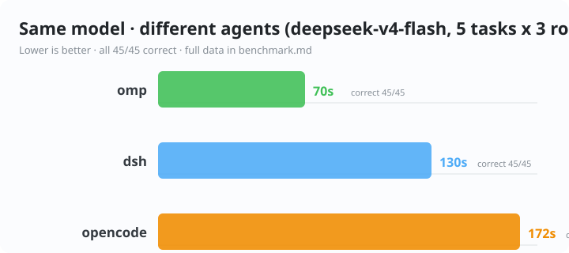

# 附录 C：同模型 × 不同 Agent 实测对比（Benchmark）

> 实测日期：2026-08-13 ｜ 模型：deepseek-v4-flash（同一 opencode-go 网关，同一 API key）｜ Agent：dsh / opencode / omp
> 目的：**控制模型变量，对比 Agent 工程层的差异**（提示词、工具链、轮次管理）。
> 扩展：2026-08-13 追加 T4（生成 markdown 报告）/ T5（多文件小重构），样本 3 轮 → 5 任务 × 3 轮。

## 方法

| 项 | 说明 |
|---|---|
| 模型 | `deepseek-v4-flash`（三 agent 均走 opencode-go 网关 + 同一 key，公平对照） |
| Agent | dsh（headless profile）、opencode（`opencode run`）、omp（`--print` 非交互） |
| 任务 | T1 创建文件 / T2 搜索统计 / T3 修复 bug + 验证 / T4 读数据生成报告 + 自复核 / T5 多文件重构 + 测试通过 |
| 环境 | Windows 11 + Node 24，独立工作目录，无预置上下文 |
| 度量 | 耗时（秒）+ 正确性（人工核对产物/输出） |

任务说明（T4/T5 为合成数据，无隐私风险）：

| 任务 | 输入 | 要求 | 人工核对标准 |
|---|---|---|---|
| T4 生成报告 | `data.json`（4 条合成销售记录） | 生成 `report.md`：数据表格 + 汇总（总销量/总营收/最畅销），自复核 | 汇总数字与数据一致（397 / 130853 / 耳机） |
| T5 多文件重构 | `mathops.py` + 依赖它的 `main.py`（含断言） | 把 `multiply` 的乘法逻辑提取为 `_multiply` 辅助函数，不改 `main.py`，`python main.py` 通过 | 出现 `_multiply` 且 multiply 委托调用、断言全过 |

## 结果（3 轮采样，取中位数）

| Agent | T1 创建文件 | T2 搜索统计 | T3 修 bug+验证 | T4 生成报告 | T5 多文件重构 | 总计（中位） | 正确率 |
|---|---|---|---|---|---|---|---|
| **omp** | 10s ✅ | 11s ✅ | 15s ✅ | 21s ✅ | 13s ✅ | **70s** | 45/45 |
| **dsh** | 22s ✅ | 15s ✅ | 48s ✅ | 26s ✅ | 19s ✅ | **130s** | 45/45 |
| **opencode** | 35s ✅ | 37s ✅ | 42s ✅ | 30s ✅ | 28s ✅ | **172s** | 45/45 |

> 总计 = 5 任务中位数相加；扩展前（仅 T1-T3）为 omp 36s / dsh 85s / opencode 114s。



原始 3 轮（秒）：

| Agent | 轮次 | T1 | T2 | T3 | T4 | T5 |
|---|---|---|---|---|---|---|
| dsh | 1 / 2 / 3 | 11 / 27 / 22 | 11 / 15 / 22 | 27 / 48 / 74 | 30 / 26 / 25 | 19 / 25 / 18 |
| opencode | 1 / 2 / 3 | 18 / 35 / 35 | 19 / 37 / 37 | 50 / 41 / 42 | 30 / 49 / 30 | 28 / 28 / 32 |
| omp | 1 / 2 / 3 | 9 / 10 / 12 | 9 / 11 / 12 | 13 / 33 / 15 | 23 / 21 / 17 | 16 / 12 / 13 |

## 解读

1. **正确率三家持平（45/45）**——5 任务 × 3 轮全部正确。同模型下，Agent 工程层的差异主要体现在**效率**而非**能力上限**；即便引入文档生成与多文件重构两类新任务，正确性差异仍未出现。
2. **总耗时稳定排序**：omp < dsh < opencode（3 轮一致，中位数相加 70s / 130s / 172s）。
3. **任务类型对效率差异的影响**（本次扩展的核心发现）——按耗时画像，5 个任务可归为三类：
   - **单步轻量**（T1 创建文件 / T2 搜索统计）：agent 间差距**最大**。opencode 35/37s vs omp 10/11s（约 **3.4×**）。任务越简单，越接近纯"启动 + 一次工具调用"开销，opencode 的启动/框架开销占比越高。
   - **多步执行 + 验证**（T3 修 bug + 跑验证 / T5 多文件重构 + 测试）：dsh 与 opencode 在此类任务上差距**显著收窄**（T5：19s vs 28s；T3：48s vs 42s 甚至反超）。多工具链场景下，双方都要多次读文件/改文件/跑命令，框架层"每步思考"成本拉平了启动开销差异；dsh 的优势在 T5 上最明显（19s，接近 omp 的 13s），而 T3 的 bug 定位仍让 dsh 偏慢。
   - **文档生成**（T4 读数据 → 写报告 → 自复核）：agent 间差距**最小**（omp 21s / dsh 26s / opencode 30s，约 1.4×）。报告生成是"读一次 + 写一次长文本"的回路，耗时主要由模型**输出 token 数**主导，Agent 工程层能优化的工具往返很少，故三家趋同。
4. **反直觉点：T5（重构+测试）普遍比 T4（写报告）更快**（dsh 19s<26s、omp 13s<21s；仅 opencode 28s≈30s）。原因：重构是"短文本代码编辑 + 秒级 `python main.py` 验证"的回路，每步模型思考短；而写 markdown 报告需要一次较长文本生成，输出时间占比高——与第 6 章"工具链任务 90% 时间在模型思考/生成"的性能模型一致。
5. **omp 的领先幅度随任务类型变化**：搜索统计类最大（T2 为 opencode 的 3.4×），文档生成类最小（T4 仅 1.4×）。说明 omp 的优势主要在**轮次少、工具调用快**，而非模型本身；当任务由长文本生成主导时，任何 agent 的工程层都难再压缩模型输出时间。
6. **波动性提示**：opencode 在 T4 第 2 轮出现 49s 离群（其余两轮 30s），dsh 在 T3 波动最大（27→74s）。多轮中位数能吸收这类网络/工具链抖动，单轮比较需谨慎。
7. **dsh 定位**：dsh 居中，且 headless 是"运行时 + 插件生态"——**同样的模型，通过插件（如提速插件降推理档）可进一步优化耗时**（见第 6 章）；T5 实测已接近 omp，说明多文件重构类任务是其相对强项。
8. **样本警示**：3 轮 × 5 任务，同网关同 key，含网络抖动——方向可信，绝对值会随环境波动。

## 可复现

```bash
# 三个 agent 的命令（独立目录）
dsh --profile headless "任务"
opencode run "任务" --model opencode-go/deepseek-v4-flash
omp "任务" --model deepseek-v4-flash --print
```

T4/T5 任务原文（T1-T3 见上一版本记录）：

<!-- [style] 任务原文代码块统一补 text 语言标签 -->
```text
T4: 读取当前目录 data.json 中的数据，生成 markdown 报告 report.md：包含每行数据的表格（产品/销量/单价三列）和汇总（总销量、总营收、最畅销产品），生成后自己复核汇总数字与 data.json 一致，完成后回复 已生成
T5: 重构 mathops.py：把 multiply 函数内的乘法逻辑提取为私有辅助函数 _multiply(a, b)，multiply 改为调用 _multiply；main.py 依赖 mathops.py 并包含断言测试，不得改动 main.py；重构后运行 python main.py 验证所有断言通过，完成后回复 已重构
```

> 完整任务定义、合成数据与产物：`~/agent-bench/bench-ext/`（T4/T5 每 agent 独立目录）；T1-T3 见 `~/agent-bench/`。白皮书仓库内 `benchmark/` 目录规划中。
